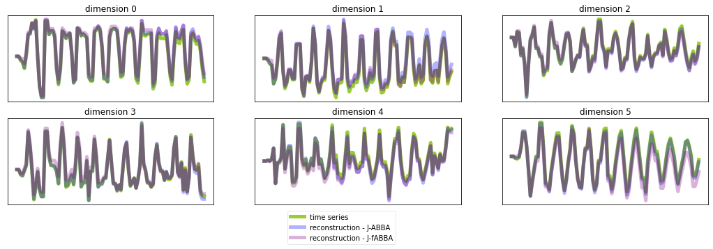

Multivariate time series symbolization
======================================

Here we domonstrate how to use ``fABBA`` to symbolize multivariate (same applies to multiple univariate time series) with consistent symbols. After downloading the `UEA time series dataset <https://www.timeseriesclassification.com/>`_ in corresponding folder, you can run JABBA following the example below:

.. code:: python

    import os
    from scipy.io import arff
    from fABBA import JABBA
    import matplotlib.pyplot as plt
    import numpy as np

    _dir = 'data/UEA2018' # your data file location

    def preprocess(data):
        time_series = list()
        for ii in data[0]:
            database = list()
            for i in ii[0]:
                database.append(list(i))
            time_series.append(database)
        return np.nan_to_num(np.array(time_series))

    filename = 'BasicMotions'
    num= 10
    data = arff.loadarff(os.path.join(_dir, os.path.join(filename, filename+'_TRAIN.arff')))
    multivariate_ts = preprocess(data)

    mts =((multivariate_ts[num].T - multivariate_ts[num].T.mean(axis=0)) /multivariate_ts[num].T.std(axis=0)).T

    jabba1 = JABBA(tol=0.0002, verbose=1)
    symbols_series = jabba1.fit_transform(mts)
    reconstruction = jabba1.inverse_transform(symbols_series)
    
    jabba2 = JABBA(tol=0.0002, init='k-means', k=jabba1.parameters.centers.shape[0], verbose=0)
    symbols_series = jabba2.fit_transform(mts)
    reconstruction_ABBA = jabba2.inverse_transform(symbols_series)
    
    fig, ax = plt.subplots(nrows=2, ncols=3, figsize=(18, 5))
    
    for i in range(2):
        for j in range(3):
            ax[i,j].plot(mts[i*3 + j], c='yellowgreen', linewidth=5,label='time series')
            ax[i,j].plot(reconstruction_ABBA[i*3 + j], c='blue', linewidth=5, alpha=0.3,label='reconstruction - J-ABBA')
            ax[i,j].plot(reconstruction[i*3 + j], c='purple', linewidth=5, alpha=0.3,label='reconstruction - J-fABBA')
    
            ax[i,j].set_title('dimension '+str(i*3 + j))
            ax[i,j].set_xticks([]);ax[i,j].set_yticks([])
    
    plt.legend(loc='lower right', bbox_to_anchor=[-0.5, -0.5], framealpha=0.45)
    plt.show()

